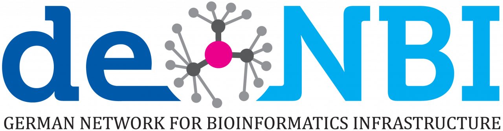

# What is Roddy?

Roddy is a framework for development and management of workflows on a batch processing cluster. It has been developed at the German Cancer Research Center (DKFZ) in Heidelberg in the eilslabs group and is used by a number of in-house workflows such as the [PanCancer Alignment Workflow](https://github.com/DKFZ-ODCF/AlignmentAndQCWorkflows) and the [ACEseq workflow](https://github.com/eilslabs/ACEseqWorkflow). The development is now continued in the Omics IT and Data Management Core Facility (ODCF) at the DKFZ.

> <table><tr><td></td><td><strong>Your opinion matters!</strong> The development of Roddy is supported by the <a href="https://www.denbi.de/">German Network for Bioinformatic Infrastructure (de.NBI)</a>. By completing <a href="yet unknown">this very short survey</a> you support our efforts to improve this tool.</td></tr></table>

# Documentation

You can find the documentation at [Read the Docs](http://roddy-documentation.readthedocs.io), including [detailed installation instructions](http://roddy-documentation.readthedocs.io/installationGuide.html).