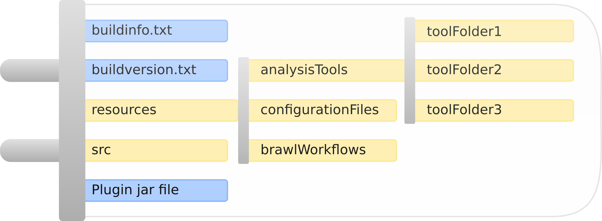

Plugin developers guide
=======================

This page should give you an idea and proper knowledge to start your own
Roddy based workflows.

Initially you should at least read the “Where to start” section.
Afterwards you can decide if you either want:

Please read the `installationGuide` if you do not have a readily installed version.

If you just need a quickstart or a short repetition, you can read :doc:`10MinutesWalkthrough`

Select the workflow type
------------------------

Before you create a new workflow, you have to decide, which type of
workflow you want to create:

1.  Java / Groovy or other JVM based plugins. We will call them JVM plugins.

2.  Brawl

3.  Bash or other native workflows like e.g. Python or Perl based

and if you want to create a new plugin or extend an existing plugin.
Of course, you can have a mix of workflows in a plugin at a later stage.

We are discussing, if we will support CWL based workflows.

Common plugin setup
-------------------

Roddy plugins are normally strictly organized. An exception to this
structure are full native plugins. But as these special plugins get converted
to the default structure, finally all plugins are organized this way.

The plugins folder name is built up in the following way:
::

  PluginName_1.0.111-1

.. Note:: The standard Roddy versioning scheme also applies to the plugin versioning scheme which is
   [major].[minor].[build] and extends it by the revision to [major].[minor].[build]-[revision].

where:

- PluginName is the name of the plugin

- _1.0.111 is the version of the plugin, this is not necessarily the same as the entry in the buildversion.txt file.
  If you omit this entry, the plugin version is 'develop' by default!

- -1 is the revision of the plugin. if you only have smaller changes, you can increase the revision number of the new plugin
  and Roddy is able to select the revised plugin instead of the former revision. You can omit this entry and Roddy will set
  the revision to -0 internally. Please be aware:
  * The revision is only valid, if you set the version! It is not valid for plugins marked as 'develop'.

  * You are also not allowed to set 'develop' as the plugin version!

There are some main components for any plugin and files for the contained workflows.

1. The buildversion.txt file contains the build number of the plugin. This number will get increased, if you pack or compile the plugin.
   The file contains exactly two lines:
   ::

      Major.Minor
      Build

   e.g.
   ::

      1.0
      182

2. The buildinfo.txt file contains information about:

  - The Roddy API level, which is e.g. 2.3 or 2.4

  - The Java version API level

  - The groovy API level

  furthermore, it contains information about dependencies to other plugins and compatibility entries.

  One example:
  ::

      dependson=PluginBase:1.2.0
      dependson=COWorkflows:1.2.20
      JDKVersion=1.8
      GroovyVersion=2.4
      RoddyAPIVersion=3.0

  This plugin depends on three other plugins with specific version. For development, it is possible to set current for the version number.
  The plugin also depends on JDK version 1.8.*/8.*, Groovy version 2.4.* and the Roddy version 3.0.*. If you do not develop a Java based
  plugin, you can omit JDKVersion and GroovyVersion.

3. The resources directory which contains:

  * The analysisTools directory, which is populated with several tool folders, e.g.
    ::

      13:45 $ ll analysisTools/
      insgesamt 8
      ... 4096 26. Jun 13:47 roddyNativeTools
      ... 4096 13. Jul 16:20 roddyTools

    The names of the tool folders will be used as the basepath entry for tool entries in your workflow configuration file.

  * The configurationFiles directory which contains one or more configuration files. Workflow configuration files need
    the prefix analysis, e.g. analysisTest.xml.

  * If you use Brawl workflows, you will store your Brawl files inside the folder brawlWorkflows.

4. The src folder for e.g. Java classes. Of course, you are free to change this and have the code organized in your own way. We tend to keep it like this.

5. The jar file, which is named after the plugin name. The jar file is only needed, if you create Java based workflows.

.. Important::
   The build* files and the analysisTools and configurationFiles folders are mandatory! If you do not create them, the plugin will not be loaded by Roddy.

Populating your plugin
----------------------

Now it is time to populate your plugin with files, configuration files and resources.
The common settings are explained in this document, plugin specific settings are explained separetely.

As noted before, you need to create at least a plugin folder with a valid name, the buildinfo and the buildversion text files and both subfolders in resources.

.. IMPORTANT::
   JVM workflows offer the highest amount of access to the Roddy API. Roddys API concepts will be explained in the description of JVM workflows. However you are allowed to mix workflow types in a plugin.

Let Roddy help you
~~~~~~~~~~~~~~~~~~

Call Roddy like this:
::

    bash roddy.sh createnewworkflow PluginID[:dependencyPlugin] [native|brawl:]WorkflowID

-  Set *PluginID* to either an existing or a new Plugin.
-  Set *dependencyPlugin* to a parent plugin
-  Select if you want a Java, a native (Bash) or a Brawl workflow
-  Finally, set the workflows name with at *WorkflowID*

So e.g. create a Java workflow called FirstWorkflow in a plugin called
NewPlugin:
::

    bash roddy.sh createnewworkflow NewPlugin FirstWorkflow

or e.g. create a Brawl workflow called SecondWorkflow in another plugin
and set it to depend on NewPlugin:
::

    bash roddy.sh createnewworkflow AnotherPlugin:NewPlugin SecondWorkflow

***Oh I have something new now… but where is it?***

Good question, that totally depends on your application ini file and the
setup plugin directories. So look up the file and take a look into all
configured directories.
